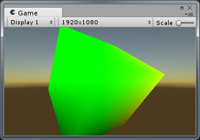
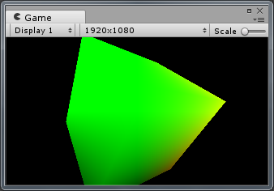
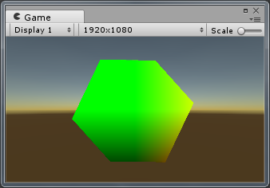
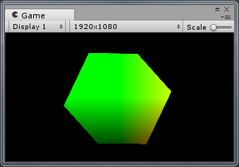

## 01_FragWorldPos

在片段着色器中获取世界坐标，并将坐标作为颜色输出。后处理阶段根据深度纹理解算出来像素对应的世界坐标，可用于做边界检测、运动模糊等效果。

透视相机，直接使用世界坐标绘制物体。

透视相机，在后处理阶段计算世界坐标并显示出来。

正交相机，直接使用世界坐标绘制物体。

正交相机，在后处理阶段计算世界坐标并显示出来。

后处理阶段，借助深度纹理获取世界坐标时，使用了两种不同的计算方法，详见相关代码。
